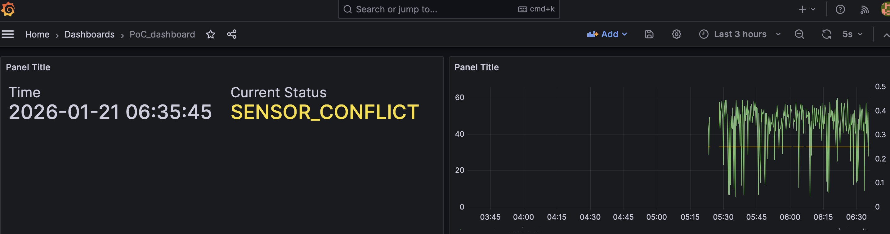

# 目次
1. [テーマの概要](#1-テーマの概要)
2. [システム全体像](#2-システム全体像)
3. [実際の作業](#3-実際の作業)
    - [担当A（Publisher）](#担当apublisher)
    - [担当B（Broker, Subscriber）](#担当bbroker-subscriber)
    - [担当C（Subscriber)](#担当csubscriber)

# 1. テーマの概要
テーマ：「衛星×地上センサのクロスチェックによる農地の遠隔監視システム」
## 前提
農業におけるIoTの一例として，地上の畑などに突き刺した土壌水分センサの値を遠隔でモニターするシステムがある．

## 課題背景
単一の地上センサを用いた農業IoTでは「センサの値がおかしい」とアラートが出た場合，それが「本当に農地が乾いている」のか「センサが故障している」のか判断できない．そのため「センサが故障しているだけなのにIT担当ではなく，農業事業者が様子を見に行く」という無駄足が起きるケースが存在する．

## 解決策
本システムは，「衛星データ（マクロ）から推定した土壌水分量」と「地上センサ（ミクロ）で計測した土壌水分量」をエッジデバイス（ラズパイ）で比較する．2つのデータに矛盾がないかラズパイが判断し，信頼性の高い情報を農業事業者に提供する．
|衛星データによる土壌水分量|地上センサによる土壌水分量|ラズパイの判断|アクション|
|:---:|:---:|:---:|:---:|
|適正|適正|`OK`|何もしない|
|乾燥|適正|`SENSOR_CONFLICT`|IT担当が対処|
|適正|乾燥|`SENSOR_CONFLICT`|IT担当が対処|
|乾燥|乾燥|`CRITICAL_DROUGHT`|農家が対処|

# 2. システム全体像
演習資料5.2節のMQTT over TLS（MQTTS）と殆ど同じ．


## データの流れ
1. Publisher: ラズパイが，インターネットから衛星データを取得し，土壌水分量を推定．
2. Publisher: ラズパイが，仮想の土壌水分センサから値を取得．
3. Publisher: ラズパイが，2つのデータを比較判定（正常/異常/矛盾）し，デジタル署名を付与．
4. Publisher: MQTTSでBroker（Mosquitto）に送信．
5. Broker: Mosquittoが，データを受信．
6. Subscriber: Telegrafが，Mosquittoからデータを取得し，InfluxDBに渡す．
7. Subscriber: Grafanaが，InfluxDBから時系列データを取得して可視化．

## セキュリティの工夫
5.2節ではセキュリティが不足している部分があるため，そこを工夫することで独自性を出す．
具体的には，「クライアント証明書」と「トピックベースの認可設定によるアクセス制御」の2つを導入する．
ファイアウォールは，めんどくさそうなので今後の課題として残す．

|脅威の種類|脅威の説明|対策|5.2節で実現済みか|
|:---|:---|:---|:---:|
|盗聴|農地の情報が第三者に傍受される|TLSによる通信経路の暗号化[^1]|◯|
|改ざん|通信経路でデータが書き換えられる|TLSによるデータの完全性保護（MAC）[^3]|◯|
|ネットワークレベルのリプレイ攻撃|過去の通信データを再送して処理を誤らせる|TLSによるセッション管理|◯|
|不正アクセス|許可されていない端末や外部ネットワークから接続される|ファイアウォール[^1]|×|
|Brokerのなりすまし|不正なBrokerにデータを送信してしまう|TLSのサーバ証明書による認証[^2]|◯|
|Publisherのなりすまし|本当は異常なのに正常値を送りつける（逆も然り）|TLSのクライアント証明書による認証[^2]|×|
|Subscriberのなりすまし|不正なSubscriberがデータを受信する|TLSのクライアント証明書による認証[^2]|×|
|アクセス権限の逸脱|認可されていないトピックへのPublish／Subscribe|トピックベースの認可設定によるアクセス制御[^1]|×|

# 3. 実際の作業
## 担当A（Publisher）
作業ディレクトリ：`iot-agri-monitor/edge_device`
- 衛星データのAPIを叩いて衛星画像を取得し，土壌水分量を推定[^4]するコードを書く．
- 仮想地上センサの値を生成するコードを書く．
- 2つの値を比較した結果を，サーバ認証・クライアント認証ありで送信し続けるコードを書く．
    - トピック：`topic = "iot/field/raspi_01/live"`
    - ペイロード（JSON）：
    ```
    payload = {
        "device_id": "raspi_01",
        "timestamp": time.time(),
        "data": {
            "vwc_satellite": 0.0 から 0.6 程度の数値,
            "vwc_ground": 0.0 から 0.6 程度の数値,
            "status": "OK" か "SENSOR_CONFLICT" か "CRITICAL_DROUGHT"
        }
    }
    ```

    - 送信：`client.publish(topic, json.dumps(payload), qos=1)`

## 担当B（Broker, Subscriber）
作業ディレクトリ：`iot-agri-monitor/cloud_stack`

5.2節の構成に「クライアント証明書」と「アクセス制御」を追加する担当．
### i. クライアント証明書の導入（実装済み）
やることが多すぎるのでココは実装済み．
1. `iot-agri-monitor/gen_certs.sh`を実行
2. `mosquitto.conf`に追記する．
```
require_certificate true      # クライアント認証を必須にする！
use_identity_as_username true # 証明書のCNをユーザー名として扱う
allow_anonymous false         # 誰だかわからない接続は拒否
```
3. `docker-compose.yml`を編集して，telegrafのコンテナにクライアント証明書をマウントする．
4. `telegraf.conf`にクライアント証明書の場所を記載する．
5. ラズパイには`ca.crt`・`publisher.crt`・`publisher.key`をコピーする．

### ii. トピックベースの認可設定によるアクセス制御
クライアント認証を導入しただけだと，Mosquittoはクライアントが提示した証明書が`publisher.crt`でも`telegraf.crt`でも同じ「クライアント」としか思っていない．
その場合，例えばSubscriberの情報が漏洩しただけで，攻撃者が「Subscriberのなりすまし」だけでなく「Publisherのなりすまし」もすることができる．

そこで，アクセス制御を行う．
`publisher.crt`を持つクライアントはpublishのみ，`telegraf.crt`を持つクライアントはsubscribeのみしかできないようにBrokerで設定しておく．ACLファイルを作成して，そこに設定を記述するらしい．

参考：https://www.sinetstream.net/docs/userguide/mqtt-authorization.html

## 担当C（Subscriber）
Grafanaでデータを可視化する担当，InfluxDBからデータを取得するクエリを書き，良さげなグラフの形式を選ぶ．

参考：https://kirmav.blogspot.com/2022/10/grafana.html

こういう感じ．


[^1]: [MQTTで強化するセキュリティ対策を分かりやすく解説 | オージス総研](https://www.ogis-ri.co.jp/column/iot/column/c107973.html)
[^2]: [mTLS（相互TLS）とは？SSL/TLSとの違いから分かりやすく解説 | GMOグローバルサインカレッジ](https://college.globalsign.com/blog/pki_mtls_20251010/)
[^3]: [SSL／TLS（Part.2）：不正アクセスを防止するSSL/TLS（3）（3/3 ページ） - ＠IT](https://atmarkit.itmedia.co.jp/ait/articles/0010/21/news001_3.html)
[^4]: [The optical trapezoid model: A novel approach to remote sensing of soil moisture applied to Sentinel-2 and Landsat-8 observations](https://www.sciencedirect.com/science/article/abs/pii/S0034425717302493)
